

# Tonu.app

[English](README.md) · [中文](README.zh.md) · [Español](README.es.md) · Deutsch · [Français](README.fr.md)

> **Dieses Repository ist ein Schaufenster, keine Quellcode-Veröffentlichung.** Tonu.app ist ein privates Projekt, deshalb gibt es hier keinen Code, nur was es kann, wie es gebaut ist und wie es aussieht. Wenn du darüber sprechen möchtest, melde dich über mein [GitHub-Profil](https://github.com/frommmmmg).

**Foto hineinwerfen, Dutzende Farbpaletten-Poster im Stil von Inspirations-Feeds erhalten, eines auswählen, jedes Detail anpassen und als PNG speichern oder teilen.** Alles passiert im Browser. Es wird nichts hochgeladen, außer du entscheidest dich zum Teilen.

**Highlights**

- **Wahrnehmungsbasierte Farbextraktion.** Das Bild wird verkleinert, in **OKLab** umgerechnet, mit **k-means++** geclustert und jedes Cluster bewertet. Eine gewichtete Farthest-Point-Auswahl wählt Farben, die repräsentativ und zugleich unterscheidbar sind.
- **Ehrliche Farbnamen, in deiner Sprache.** Namen stammen vom nächstgelegenen Eintrag in öffentlichen Farbtabellen (ISCC-NBS, CSS, Tailwind, Material, xkcd) nach OKLab-Abstand, nicht aus maschineller Übersetzung. Traditionelle Systeme wie die traditionellen Farben Japans und Chinas sind eingebaut.
- **Eine Stil-Engine, keine Vorlage.** Ein Stil ist eine JSON-Spezifikation. **15 Layout-Engines, über 30 Presets und rund 90 einstellbare Parameter**, darunter acht kreisförmige Layouts, Schatten, Texturen, Oberflächen, Rahmen und Foto-Behandlungen.
- **Farbblock direkt auf dem Poster ziehen.** Frei verschieben oder an einer Seite einrasten lassen, oder den genauen Versatz per Schieberegler setzen. Das Ziehen beginnt erst nach ein paar Pixeln, ein Tippen kopiert also weiterhin den Farbwert.
- **Schwebende Vorschau auf dem Handy.** Beim Scrollen durch die Einstellungen bleibt das Poster in einem kleinen Fenster, das du verschieben, in der Größe ändern und anheften kannst. Mit Pinch, Mausrad oder +/- zoomst du wie mit einer Lupe bis 8x und prüfst ein Detail, während du einen Wert änderst.
- **Hover-Vorschau.** Zeigst du auf eine Option, siehst du sie am aktuellen Poster, bevor du dich entscheidest.
- **Fünf Oberflächen-Skins, jeweils hell und dunkel:** Korrekturraum, Weiße Wand, Papierjournal, Multicolor und Terminal. Sie werden bei Bedarf geladen und verändern nur die Oberfläche, nie die Poster.
- **Andockbares Bedienfeld.** Links, unten oder rechts platzieren, durch Ziehen am Rand die Größe ändern, die Wahl wird auf dem Gerät gemerkt.
- **14 Oberflächensprachen.**
- **Export wie auf dem Bildschirm.** Schriften werden eingebettet, damit das PNG überall gleich aussieht, auf dem Handy öffnet sich das native Teilen-Menü, und die letzten Arbeiten bleiben auf dem Gerät.
- **Schriften sauber gehandhabt.** 12 mitgelieferte Open-Source-Schriften, dazu eigene Dateien, URLs oder installierte Schriften, mit klar benannter Lizenzverantwortung.

**Technik:** Vanilla JavaScript · OKLab · html-to-image · Cloudflare Workers + KV + D1 für geteilte Poster

Live unter **[tonu.app](https://tonu.app)**. Das Beispielfoto in den Screenshots stammt von Andrés Beltrán Espinosa auf Unsplash.

## Screenshots

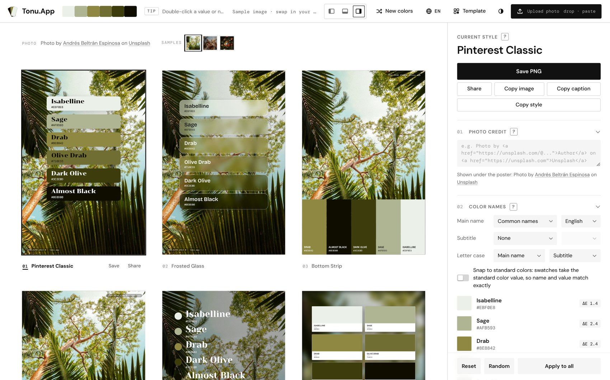
*Die Galerie: ein Foto, viele Poster-Stile.*

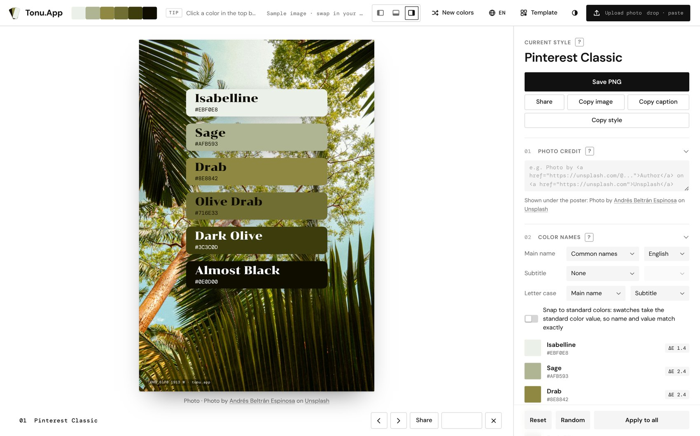
*Die große Ansicht. Das Einstellungsfeld bleibt daneben aktiv.*

<table><tr><td align="center" width="33%">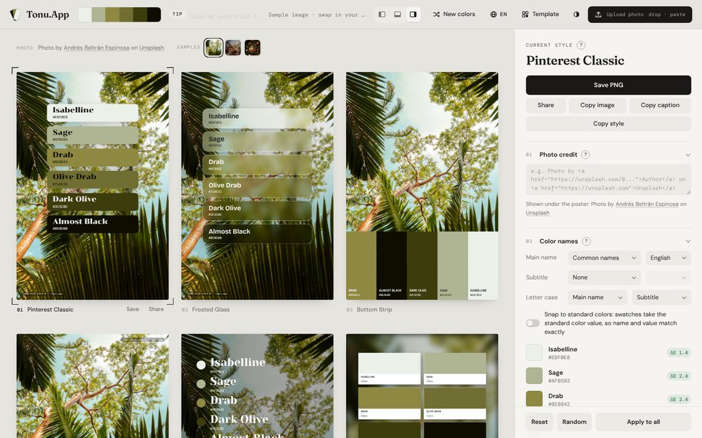 Korrekturraum</td><td align="center" width="33%"> Weiße Wand</td><td align="center" width="33%">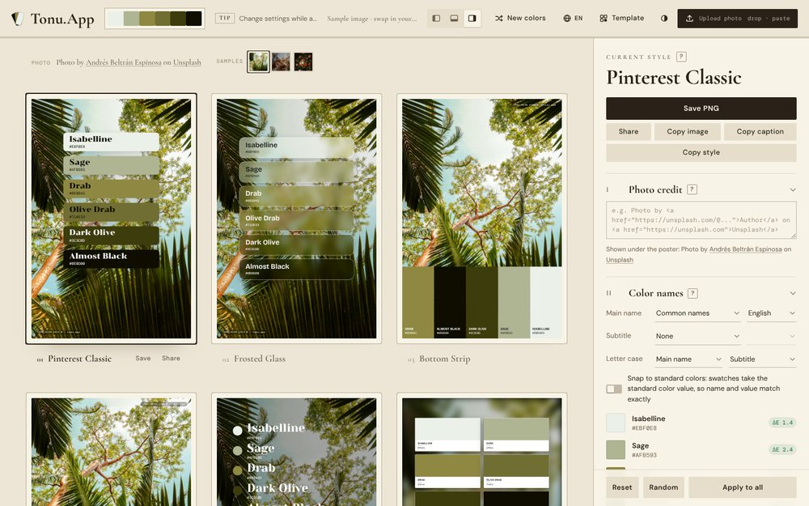 Papierjournal</td></tr><tr><td align="center" width="33%">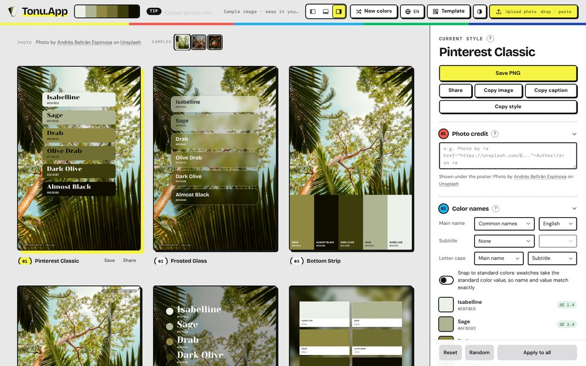 Multicolor</td><td align="center" width="33%">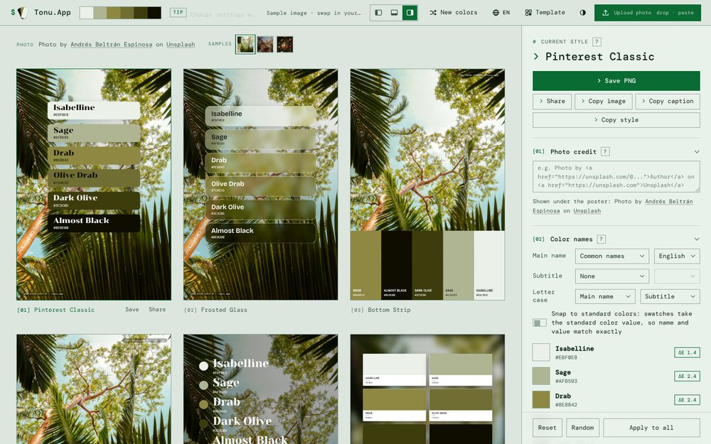 Terminal</td><td align="center" width="33%">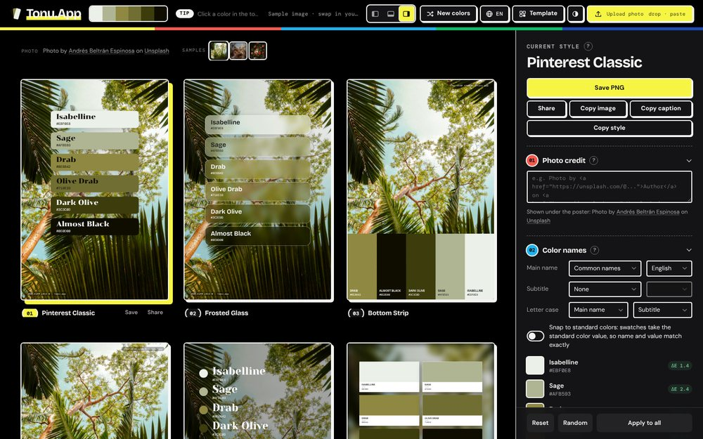 Multicolor, dunkel</td></tr></table>

*Fünf Oberflächen-Skins, jeweils mit hellem und dunklem Modus.*

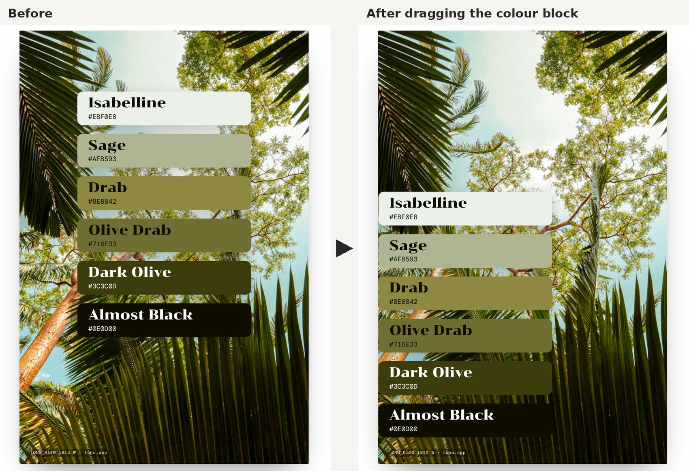
*Den Farbblock an eine beliebige Stelle des Posters ziehen.*

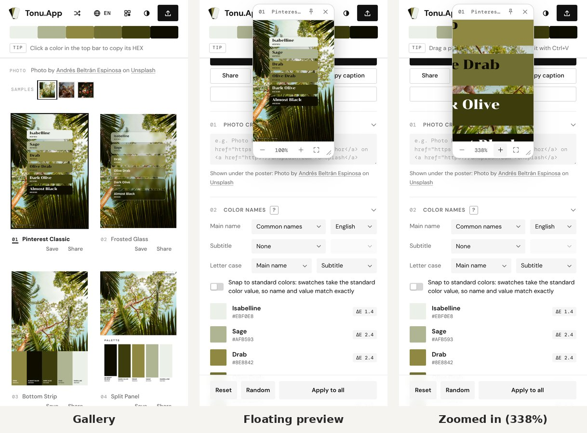
*Auf dem Handy: die Galerie, die schwebende Vorschau über den Einstellungen und die auf 338 % vergrößerte Vorschau.*

<table><tr><td align="center" width="50%">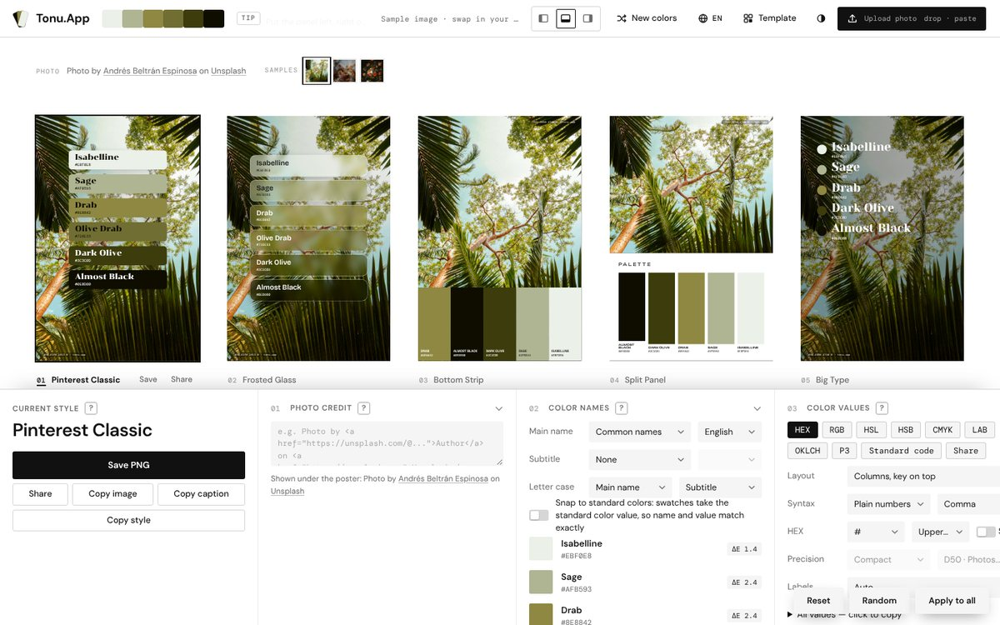 Unten</td><td align="center" width="50%">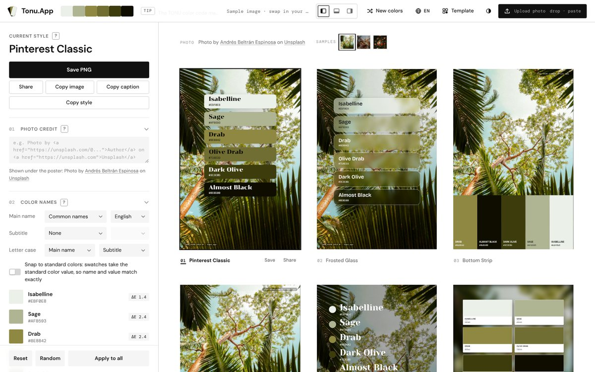 Links</td></tr></table>

*Das Bedienfeld unten und links angedockt.*

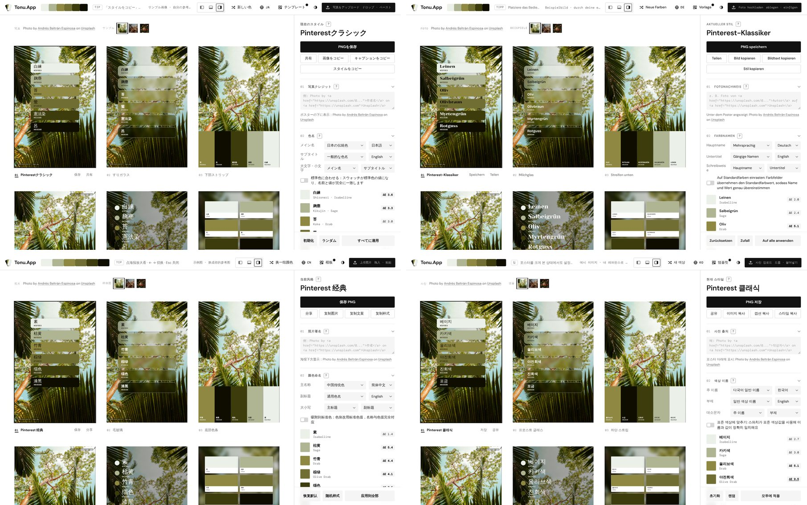
*Derselbe Bildschirm in vier der 14 Oberflächensprachen. Farbnamen folgen der Sprache, zum Beispiel die traditionellen Farben Japans.*

## So funktioniert es

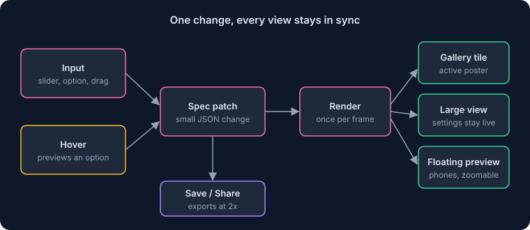
*Eine Änderung aktualisiert Galerie, große Ansicht und schwebende Vorschau gleichzeitig.*

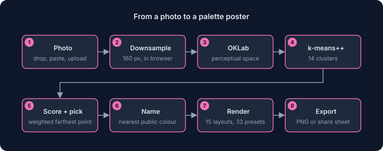
*Alles von der Farbextraktion bis zum Export läuft im Browser.*

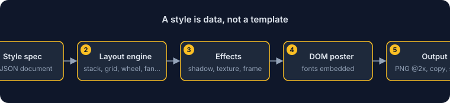
*Stile sind JSON-Spezifikationen, die die Layout-Engines in Poster verwandeln.*

---

Screenshots verwenden nur Beispiel- oder öffentliche Daten. © Alle Rechte vorbehalten. Beschreibungen dürfen mit Quellenangabe zitiert werden; die Software selbst darf nicht weitergegeben werden.

