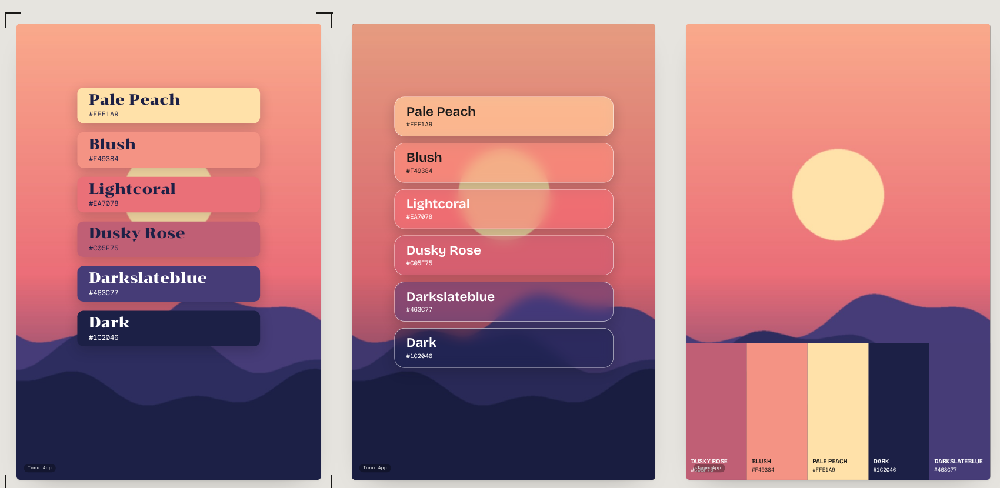
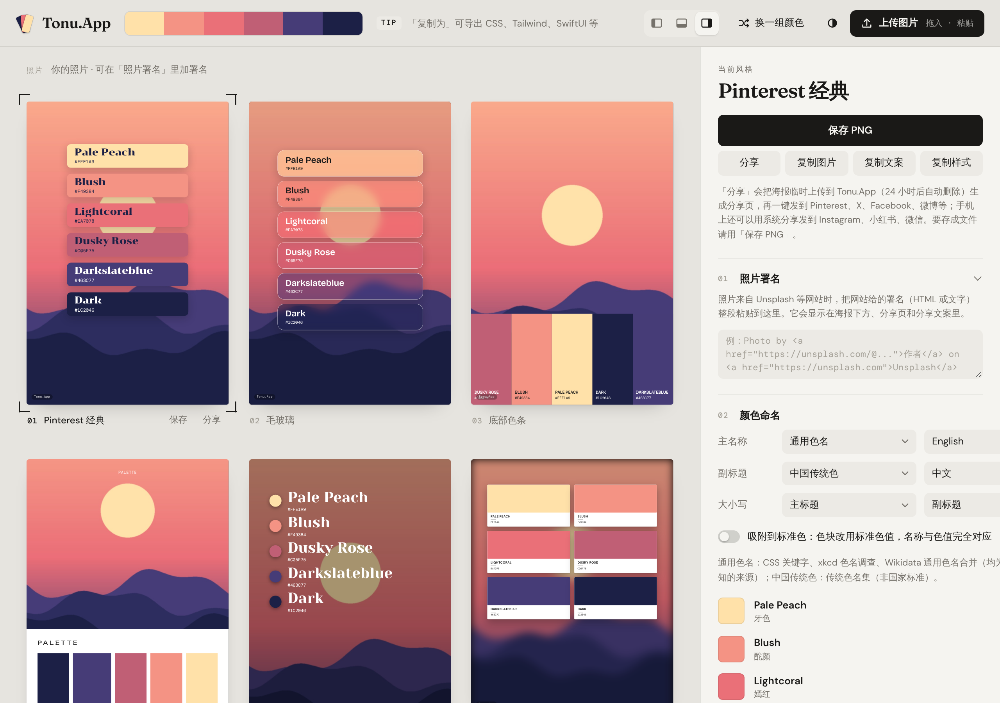

# Tonu.app

[English](README.md) · [中文](README.zh.md) · Español · [Deutsch](README.de.md) · [Français](README.fr.md)

> **Este repositorio es un escaparate, no una publicación de código.** Tonu.app es un proyecto privado, así que aquí no hay código: solo qué hace, cómo está construido y qué aspecto tiene. Si quieres hablar de él, escríbeme desde mi [perfil de GitHub](https://github.com/frommmmmg).

**Sube una foto y obtén una docena de pósters de paleta al estilo de los feeds de inspiración; elige uno, retócalo y guarda el PNG o compártelo.** Todo ocurre en el navegador. No se sube nada salvo que decidas compartirlo.

**Puntos clave**

- **Extracción de color perceptual.** La imagen se reduce, se convierte a **OKLab**, se agrupa con **k-means++**, se puntúa cada grupo y un muestreo ponderado del punto más lejano elige colores representativos y distintos entre sí.
- **Nombres de color honestos.** Los nombres salen de la entrada más cercana en tablas públicas de color (ISCC-NBS, CSS, Tailwind, Material, xkcd) por distancia OKLab, sin traducción automática.
- **Un motor de estilos, no una plantilla.** Un estilo es una especificación JSON. **15 motores de diseño y 33 preajustes**, con ocho diseños circulares (rueda, abanico, órbita, burbujas y más), además de sombras, texturas, acabados, marcos y tratamientos de foto opcionales.
- **Exportación idéntica a la pantalla.** Las fuentes se incrustan para que el PNG se vea igual en todas partes, y en el móvil se usa el menú nativo de compartir.
- **Gestión de fuentes bien hecha.** 12 fuentes de licencia abierta incluidas, más tus propios archivos, URLs o fuentes instaladas, con la responsabilidad de licencia indicada con claridad.

**Tecnología:** JavaScript puro · OKLab · html-to-image · Cloudflare Workers + KV + D1 para los pósters compartidos

En línea en **[tonu.app](https://tonu.app)**.

## Capturas

*Tres de los estilos de póster generados. La foto es una muestra sintética.*

*El editor: galería de estilos a la izquierda, nombres de color y exportación a la derecha. (La interfaz está ahora en chino.)*

## Cómo funciona

*Todo, desde la extracción de color hasta la exportación, se ejecuta en el navegador.*

*Los estilos son especificaciones JSON que los motores de diseño convierten en pósters.*

---

Las capturas usan solo datos de ejemplo o públicos. © Todos los derechos reservados. Las descripciones pueden citarse con atribución; el software no se puede redistribuir.

